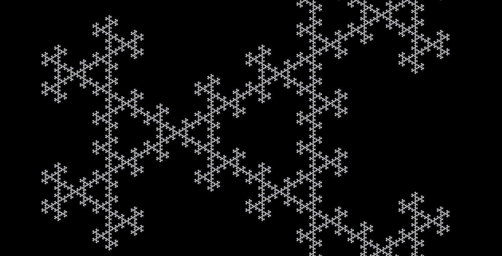

# Sierpinski's Gasket
C based utility to render the Sierpinski's Gasket, and similar images.

# Background
Sierpinski's Gasket (https://en.wikipedia.org/wiki/Sierpinski_triangle) can be produced by a simple process:  
1) Set three starting points.  
2) Pick a point (from your starting set) at random.  
3) Go half the distance to another random starting point.  Plot the output.  
4) Go back to step #3.  

This program allows you to set 'N' many starting points (not just three), and instead of finding and plotting the mid-point, you may close any fractional distance to the next point in the x and y direction.  Rotational symmetry may also be enabled.

# How To Use This Program
Download all the project files.  They are:

o sierpinski_gasket.c

o Makefile

o sierpinski.h

Compile the project with: `make`

Then run: `./sierpinski` from the current directory with any of the available options:  

 o -h                      print the help screen  
 o -R NUM                  seed randomizer with NUM  
 o -f NAME [/tmp/gasket.tif]       file to write  
 o -S NUM>1 [1]            enable rotational symmetry axis  
 o -I                      invert colors in final image  
 o -x XRES [1000]          image x resolution  
 o -y YRES [1000]          image y resolution
 o -xd XDIV [2.000000]             x division scale  
 o -yd YDIV [2.000000]             y division scale  
 o -m XMIN [-1.500000]     graph x axis minimum  
 o -M XMAX [1.500000]      graph x axis maximum  
 o -l YMIN [-1.500000]     graph y axis minimum  
 o -L YMAX [1.500000]      graph y axis maximum  
 o -n NUMV [3]             number of points around circle to start with  
 o -s SAMPLES [20000]      number of image samples  
 o -i NUM>20 [1000]        number of iterations to run per sample  
 o -r 0<=NUM<=255          set static RED channel value  
 o -g 0<=NUM<=255          set static GREEN channel value  
 o -b 0<=NUM<=255          set static BLUE channel value  
 o -sup NUM [1]            super sample NUM^2 bit buckets  
 o -G NUM [1.000000]       correctional gamma factor  
 o -p FILE                 color palette file  
 o -T THREADS [16] number of threads to run  

See my Java-ColorToy project for more information on setting up color options: https://github.com/jameswmccarty/Java-ColorToy 

Example format for color palette:

0.46 0.5 0.15  
0.34 0.47 0.43  
1.5 0.0 0.5  
0.1 0.64 0.48  

